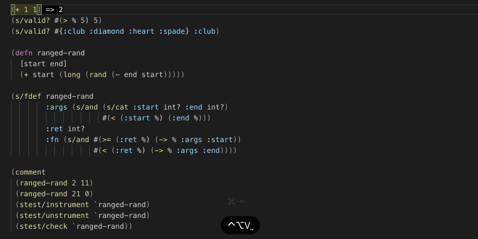

this project contain coder with
all clojure development  system

#  component
1. java
2. [clojure](https://clojure.org/index)
3. [clojure cli](https://clojure.org/guides/deps_and_cli)
4. [lein](https://leiningen.org/)
5. [shadow-cljs](https://github.com/thheller/shadow-cljs)
6. [codercom](https://github.com/codercom/code-server)
7. with extensions [calva](https://github.com/BetterThanTomorrow/calva)
8. and [parinfer](https://shaunlebron.github.io/parinfer/)

#  used 

### go to your project directory
- if you don't have clojure code before then you can use any directory
### run
docker run -it -p 8443:8443 -v "${PWD}:/home/coder/project" vehas/coder-clojure --no-auth  --allow-http

### and go to  http://localhast:8443
- you will see  codercom start, It's look as same as vs code in browser and it's also include  calva and parinfer
### click terminal > new terminal to make new one
- if you just start with clojure you can type `lein new app` to make new clojure app then  `lein repl`
- or  if you familiar with clojure you can just type `lein repl` or `shadow-cljs run watch`
### then connect calva with repl by type short key `cmd+shift+p` to open vs code navigator then type `calva: Connect `
- you should be able to use clojure with repl now, ping me if you have any problem
- calva demo: (copy from [calve repo](https://github.com/BetterThanTomorrow/calva))
  

# development

### bulid
docker build -t vehas/coder-clojure .
